# Capstone_Project-Airline-delays

## Table of Contents
* [Project Overview](#project-overview)
* [Purpose and Problem Statement](#purpose-and-problem-statement)
* [Dataset Details](#dataset-details)
* [Project Database Design](#project-database-design)
* [Technologies Used](#technologies-used)
* [Machine Learning Models and Findings](#machine-learning-models-and-findings)
* [Results of exploratory data analysis](#results-of-exploratory-data-analysis)
* [Challenges](#challenges)
* [Reflection and Next Steps](#reflection-and-next-steps)
* [Contributors](#contributors)

## Project Overview
One of the most recognisable performance metrics of any transportation system is a delay. Notably, those involved in commercial aviation define delay as the amount of time that an aircraft is running late or postponed. Authorities in charge of national regulatory oversight have a wide range of indications relating to tolerance limits for aircraft delays. In the context of air transportation networks, flight delays are undoubtedly an important topic. Every year approximately 25-30% of flights are delayed, costing passengers and the operations approximately $36 billion in money and their time.

## Purpose and Problem Statement
The purpose of this project is to thoroughly analyse the historic data, gain valuable insights, experiment with the input features to see how the prediction accuracy varies, and contribute to the identification of solutions based on the results.

Flight prediction is crucial during the decision-making process for all players of commercial aviation. By conducting an analysis of flight times and metrics regarding airlines, day of travel, and airport arrivals/departures we can predict what flights are more likely to experience delays.

## Dataset Details
The dataset used for this project was obtained from Kaggle. This dataset tracks the performance of domestic flights within United States. It covers extensive airline, weather, airport, timetables, and other related details for flight operations in 2019.

**Source Link** 
https://www.kaggle.com/datasets/threnjen/2019-airline-delays-and-cancellations

Before we began the process of training the models, predicting outcomes and building visualizations, we performed some pre-processing steps on the dataset to clean it such as removing null values, handling any missing values, formatting dates, required feature selection, dropping irrelevant values, formatting datatypes and finally joining all datasets into one master set of data, using the below relationship diagram.

## Project Database Design

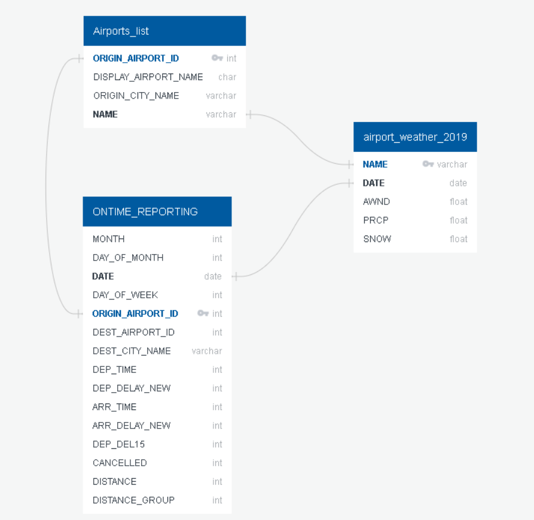

## Technologies Used
* Python
* Pandas
* Numpy
* Pathlib
* Spark
* SQL
* Tableau
* Google Slides

## Machine Learning Models and Findings
### Models Tested:  
#### Supervised Learning  
* Logistic Regression Model
* Balanced Random Forest Classifier
* Easy Ensemble AdaBoost Classifier

### Findings: 

**Logistic Regression Model** 

The Logistic Regression Model is used to predict whether a flight will be delayed or not based on various factors such as the day of the week, routing of the flight and weather conditions. 

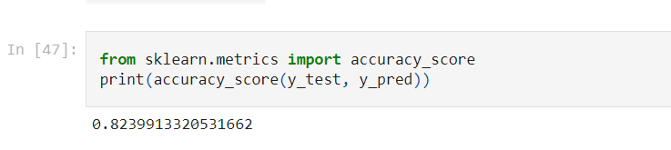

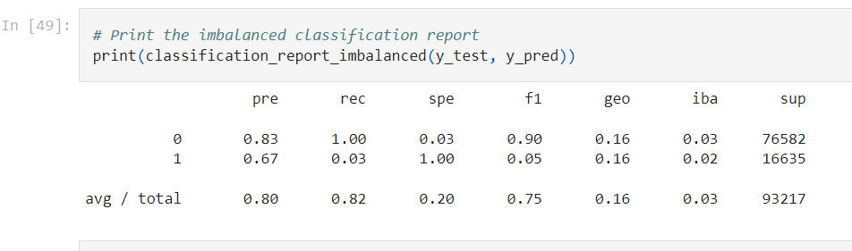

**The accuracy score of the model is 82.4% which means the prediction power is decent.**   

The precision score for no delay (denoted by 0) is 83%. This means when the model predicts the flight will not delay, it is correct 83% of the time. The precision score for delay (denoted by 1) is 67%, which means the prediction power is not as good as no delay, but it is still decent.   

The F1 score (harmonic mean) of the no delay and delay is 90% and 0.05%, respectively. This suggests the model handles prediction for no delay very well, but a different story for prediction for delay. 

Compared to the ability to predict no delay, the ability to flag potential delay is more important. More data could be introduced in future to better train the Logistic Regression Model. 

**Balanced Random Forest Classifier** 

The Balanced Random Forest Classifier Model is adopted to test if this will improve the accuracy.  

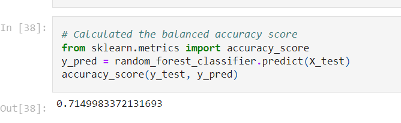

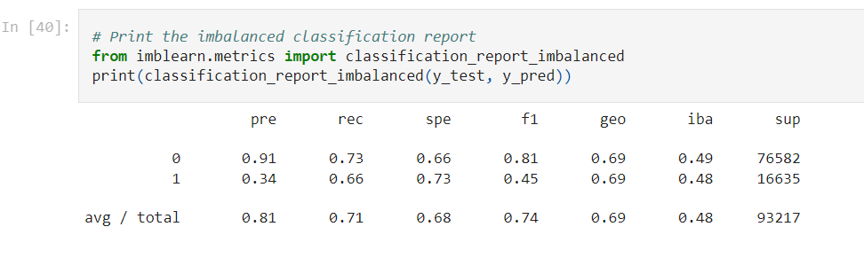

**The accuracy score of the model is 71.5%, which means the prediction power is worse than the Logistic Regression Model.**    

The precision score for no delay (denoted by 0) is 91%. This means when the model predicts the flight will not delay, it is correct majority of the time. However, the precision score for delay (denoted by 1) is on the lower end (34%), and that means the model is not very good at predicting if the flight will delay (around one-third of the predictions are correct).  

The F1 score (harmonic mean) of the no-delay and delay is 81% and 45%, respectively. This suggests the model handles prediction for no-delay better than delay. The F1 score of this model is better than the Logistic Regression Model and the Easy Ensemble AdaBoost Classifier Model.  

**Easy Ensemble AdaBoost Classifier** 
The Easy Ensemble AdaBoost Classifier Model is also adopted to improve the prediction accuracy.  

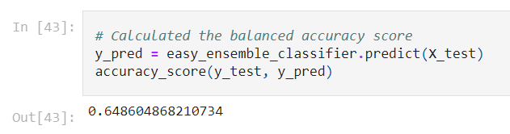

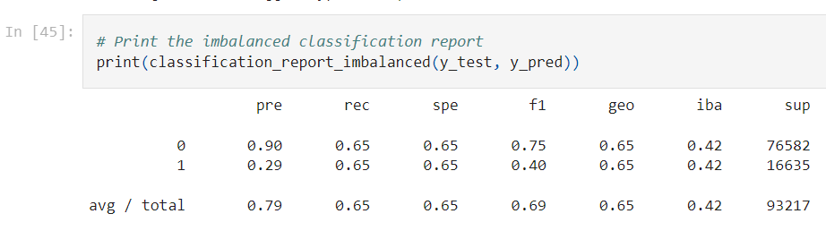

**The accuracy score of this model is 64.9%, which means the prediction power is not satisfactory. The accuracy score for this model is the lowest among the three.**  

The precision score for no delay (denoted by 0) is 90%. This means when the model predicts the flight will not delay, it is correct most of the time (90%). However, the precision score for delay (denoted by 1) is on the lower end (29%), and that means the model is not very good at predicting if the flight will delay (again around one-third of the predictions are correct).  

The F1 score (harmonic mean) of the no delay and delay is 75% and 40%, respectively. This suggests the model handles prediction for no delay better than delay.  

## Results of exploratory data analysis
Below are some questions that have been answered using visual representation of our data.

**1. Which airline has the most delayed flights?**  

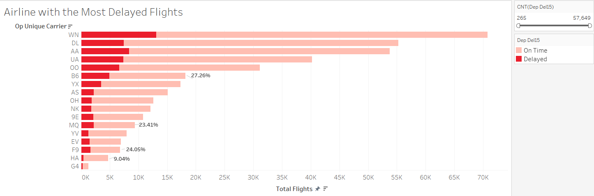

- The top 3 airlines with the highest percentage of delayed flights to total flights are: JetBlue (B6), Frontier Airlines (F9) and Envoy Air (MQ).  
- The airline with the lowest percentage of delayed flights to total flights is Hawaiian Airlines (HA).  
- The majority of the listed airlines has a percentage of delayed flights that falls in between 14% and 21%.   

**2. Which routes have the most delayed occurrences?**  

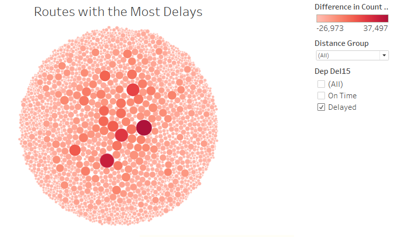

* The top 5 routes with the most delays:  
	- Chicago, IL to New York, NY
	- New York, NY to Chicago, IL
	- Boston, MA to New York, NY
	- Los Angeles, CA to San Francisco, CA
	- San Francisco, CA to Los Angeles, CA  

Overall, it was determined that the flights going in and out of New York,NY appear to face the most delays.  

**3. Will flying time impact delay occurrences?**  

The 11 distance groups in the graph below represent different lengths of flight distance, with distance group 1 covering a distance of 0 - 250 km. Each consecutive group has an increased distance of 250 km.   

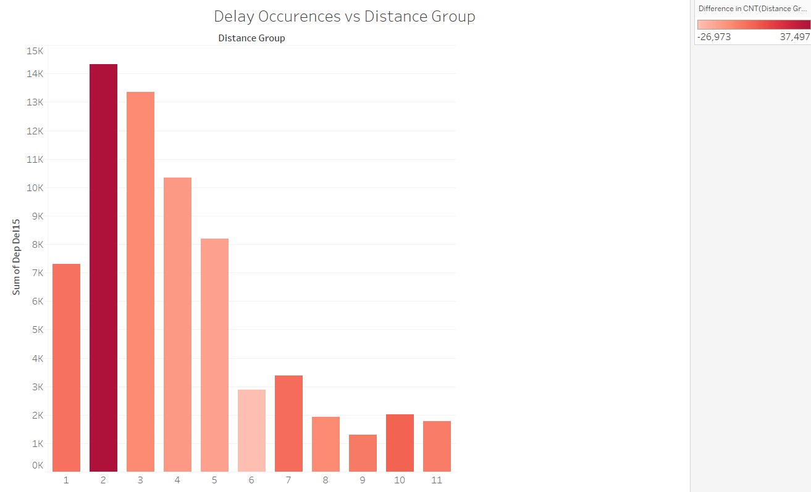

Distance group 2 (250 - 499 km) has the most occurrences of delayed flights followed by distance group 3. The longer distanced flights, beginning from distance group 6 (1250 km) to distance group 11 (4999 km), have the least amount delayed flights.   

**4. Which day of the week has the most delays? Which airport is the worst with delays?**  

Overall, the busiest airports and busiest weekdays have the most amount of delayed flights. Thursday has the most amount of flights of the week as well as the most amount of delayed flights. Saturday has the least amount of total flights as well as the least amount of delayed flights. The majority of delayed flights occured during the weekdays.  

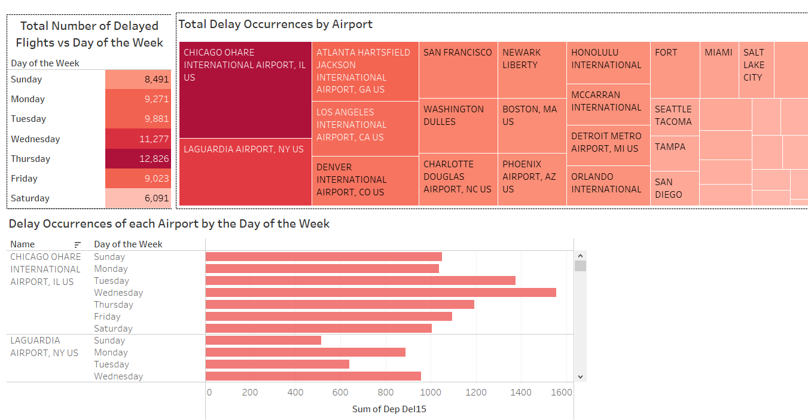

The Chicago O'Hare airport had the most overall flight delays and had the second most flights in total. Atlanta Hartfield Jackson had the most flights of all the listed airports and had the third most flight delays. Minneapolis St. Paul airport had the least amount of flights and flight delays of all the listed airports.   

## Challenges
One of the biggest challenge for us as the sheer size of the dataset, as even with just 1 year worth of data, it amounted to over a million rows. The key challenge of this was the amount of time taken to run all combinations across multiple folds, which ultimately caused the codes and files to breakdown. This drastically slowed down our progress and our ability to utilize more data to garner better results.  

Another challenge with the dataset we worked with was that there was scattered information about weather that we could not use efficiently and as planned for our analysis and modeling. There were many values and columns that were redundant and were removed.

## Reflection and Next Steps
The current dataset solely deals with the month of January in the year of 2019. Given more time, we would include all 12 months worth of data for our prediction and analysis.   

There is a huge scope for future work, some of which is identified below:   

- Using additional datasets to integrate other routes, international flights,more months etc.   
- Performing additional exploratory data analysis to include items such as but not limited to time series analysis, correlation analysis,weather conditions impact analysis, national holiday's impacting the delays etc.
- Testing the machine learning model with other datasets.

## Contributors
Zainab Cheentavida  
Gopi Desai  
Ashley Walsh  
Tracy Chan  
Kiena Dang  

